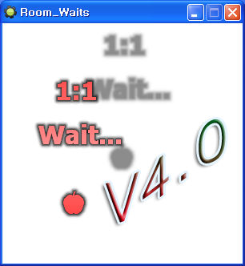

# 39DLL SimpleScripts

A networking script library for GameMaker 8. It wraps the socket functions of 39DLL into 31 `sk_` scripts that cover hosting a server, joining it, managing players, and sending and receiving messages. The goal was to let people build multiplayer games without touching socket buffers themselves. It shipped as a script resource file with a script reference and five examples that build up from connecting to a small game.

<p>
  
</p>


## How to use

The Releases download contains the script resource (`.gmres`), the 39DLL extension (`.gex`), a script reference, and the examples. Install the 39DLL extension in GameMaker 8, then load the script resource through `File > Import Resources`.

Connecting takes three lines. Whoever opens the server becomes the host, and the others join with the host's IP.

```gml
sk_set_39dll("127.0.0.1", 12345)
if sk_socket_make("Host") { ... }        // open a server
if sk_socket_join("Joiner", 1) { ... }   // join, wait 1 second for a reply
```

Messages are collected and sent in one go. The message id is a number your game defines. The recipient is a player id, or one of `0` (host), `-1` (everyone but me), `-2` (everyone including me).

```gml
sk_message_save(1, -1)                    // message id 1, to everyone but me
sk_message_sadd(simple_short, 2, x, y)    // two shorts
sk_message_sadd(simple_string, 1, name)   // one string
sk_message_send()
```

The receiving side runs `sk_message_check` in a Step event and branches on the message id. Values are read by type and position, and the position counts from 0 separately for each type.

```gml
while(sk_message_check())
{
  if sk_get_message_id()=1
  {
    x = sk_get_message_var(simple_short, 0)
    y = sk_get_message_var(simple_short, 1)
    name = sk_get_message_var(simple_string, 0)
  }
}
```

There are also space messages, which are exchanged per instance. Each instance gets its own space number. Sending with `sk_space_message_save(id, recipient, object, space)` fires a User Defined event on the receiving instances. There, `sk_space_message_check(space)` tells whether the message is for this instance, and the rest is read like a normal message.

The full script list and argument descriptions are in [docs/reference.md](docs/reference.md).


## How it works

**A star layout with the server relaying.** The side that opens the server gets player id 0. A client that connects receives the socket number the server got from accept, and uses that as its player id. Clients never connect to each other. Every message goes through the server, which looks at the recipient value and decides whether to handle it itself, pass it to one client, or spread it to everyone.

**Serialization uses one buffer per type.** A packet starts with a header of recipient, kind, message id, sender id, and sender name. Then come the counts for the six types (byte, short, ushort, int, uint, string), and then the values in type order. `sk_message_sadd` only stacks values into six temporary buffers, one per type, and `sk_message_send` joins them into one packet. The receiver reads each type by its count into a 2D array indexed by `[position, type]`, which is why values are fetched by type and position.

```gml
// sk_message_sadd: stack into the buffer of that type
case 1: dll39_write_short(argument[__i+2], global._39_send_var_buffer_[1]); break;

// sk_message_check: read by count into the array
global._39_message_st_max_[1]=dll39_read_uint(global._39_saved_buffer_)
for(__i=0; __i!=global._39_message_st_max_[1]; __i+=1){global._39_message_st_sts_[__i, 1]=dll39_read_short(global._39_saved_buffer_)}
```

**Messages are queued before sending.** `sk_message_save` sends nothing. It only adds an entry to a list. `sk_message_send` walks the list building packets, and when the sender is itself one of the recipients, the packet is copied straight into its own receive buffer without going over the network. That is how a host sending to the host runs through the same code.

**Space messages are delivered through events.** When `sk_message_check` meets a space message, it raises a User Defined event on every instance of the target object. Each instance calls `sk_space_message_check` to see whether the space is its own, and once a match is found the remaining instances are skipped. This was made so many instances could split up incoming messages efficiently.

**Extras.** Setting a password wraps every packet with 39DLL's buffer encryption. Setting a send limit pauses for a moment after a given number of packets, which keeps packets from breaking when the server has little upload bandwidth. When a client's connection drops, the server closes that socket and pushes the player id into a queue that `sk_get_sleep_player_id` reads.


## Files

| Path | Contents |
|---|---|
| `source/39dll-simple-scripts.gmk` | Project file holding the scripts |
| `source/split/` | Text tree produced by GmkSplitter, with the 31 scripts as `.gml` files |
| `source/39dll_Ext.gex` | The 39DLL extension the build needs |
| `docs/reference.md` | Script reference |
| `docs/screenshots/` | Screenshots |
| Releases | Script resource, 39DLL extension, script reference, examples |


## Credits

39DLL is a widely used file and networking DLL for GameMaker, made by 39ster.


## License

zlib. See [LICENSE](LICENSE). Bundled libraries made by other people keep their own licenses.
